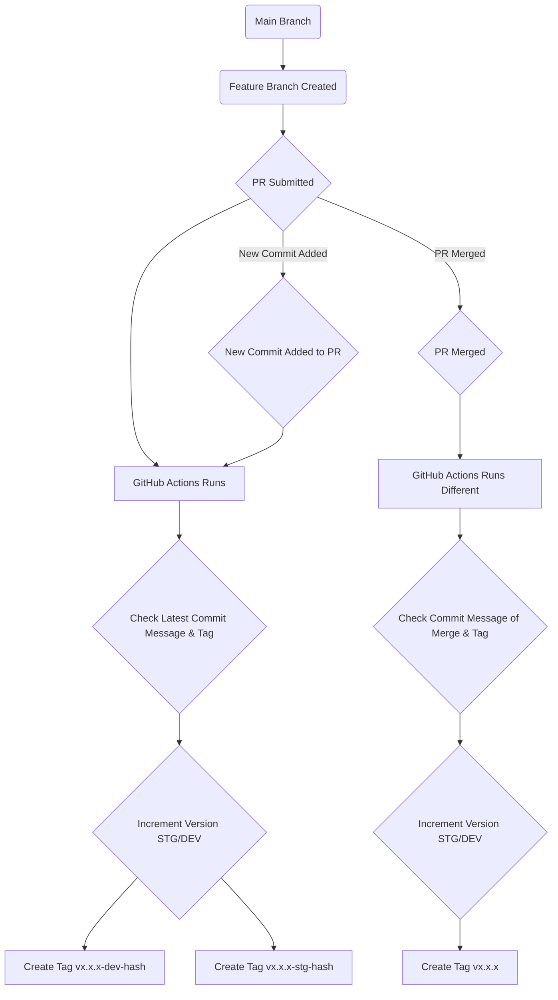

# Trunk Based Gitops CI Actions Example

This is an example of how we can use tags to automate CI while using trunk based development.

The basic flow is like this:

This means that every PR will automatically create tags for dev and stg environments using semantic versioning.
To increment MAJOR, your commit message must include `MAJOR`. This is the same for MINOR and PATCH.

The base version will be the main tagged latest tag.

Only when the PR is merged to main will it create the production tag that does not include any environment label or commit hash.

## Usecase
A CICD pipeline where CloudBuild is triggered based on tags and you want to separate Dev and Stg environments.
- You want to auto deploy to Dev and/or Stg during development. You plan to control the Stg deployment by adding an approval flow, so you want to separate Dev and Stg pipelines.
- You want to use semantic versioning without manual tagging.
